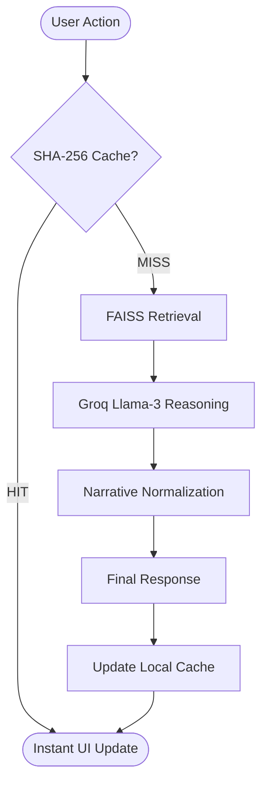

# 🚀 AI Debugging Assistant

> **A state-of-the-art, RAG-powered AI system that detects, explains, and fixes code errors in seconds with high confidence.**

**[🌐 Live Demo (Frontend)](https://code-assistant-gold.vercel.app/)** | **[📡 API Health Status](https://code-assistant-backend.onrender.com/api/health)**

[](https://fastapi.tiangolo.com/)
[](https://reactjs.org/)
[](https://groq.com/)
[](https://github.com/facebookresearch/faiss)
[](https://tailwindcss.com/)

---

## 📖 Overview

The **AI Debugging Assistant** is a professional-grade developer tool designed to eliminate the friction between encountering an error and understanding its root cause. Unlike generic AI chats, this system utilizes **Retrieval-Augmented Generation (RAG)** to cross-reference your errors against a verified knowledge base of debugging patterns, ensuring contextually accurate and actionable solutions.

### 🌟 Key Pillars
- **Intelligent Classification**: Automatically distinguishes between `Runtime`, `Syntax`, `Logical`, and `Safe Code`.
*   **Context-Aware**: Uses FAISS vector search to retrieve relevant debugging best practices before generating a fix.
- **Instant Productivity**: Clean, glassmorphic UI with typing effects, side-by-side optimization views, and local session history.

---

## ✨ Core Features

### 🧠 Deep Traversal Analysis
*   **Auto-Detection**: Dynamically classifies errors to provide targeted advice.
*   **Confidence Scoring**: Real-time evaluation of AI reasoning reliability.
*   **Why it Works**: Clearly explains the "Why" behind every suggested fix to help developers learn.

### 🚀 Optimization Suite
*   **One-Click Fixes**: Instant generation of corrected code blocks.
*   **Senior-Level Optimization**: Goes beyond fixing the bug by suggesting type hints, performance gains, and cleaner patterns.
*   **Comparative View**: Review original, fixed, and optimized versions in a streamlined panel.

### 🛡️ Production Infrastructure
*   **Smart Cache Engine**: Uses SHA-256 fingerprinting to deduplicate requests and provide instant results for repeated queries.
*   **API Resilience**: Hardened against rate-limiting with intelligent fallbacks and graceful error handling.
*   **Clean Architecture**: Separation of concerns between RAG retrieval, LLM reasoning, and Frontend state.

---

## 🏗️ Technical Architecture



---

## ⚙️ Tech Stack

| Layer | Technologies |
| :--- | :--- |
| **Backend** | FastAPI (Python), Uvicorn, Pydantic v2 |
| **Frontend** | React 19, Vite, Tailwind CSS, Lucide Icons |
| **AI / RAG** | Groq (Llama 3.3 70B), FAISS, FastEmbed, LangChain |
| **DevOps** | Concurrently, Root-Level Workspace Manager |

---

## 🚀 Getting Started

### Prerequisites
- Python 3.10+
- Node.js 18+
- [Groq AI API Key](https://console.groq.com/)

### 1. Repository & Backend Setup
```bash
git clone https://github.com/gitxpriyanshu/code-assistant.git
cd code-assistant/backend

# Create virtual environment
python -m venv venv
source venv/bin/activate  # Windows: venv\Scripts\activate
pip install -r requirements.txt

# Setup API Key
echo "GROQ_API_KEY=your_key_here" > .env
```

### 2. Frontend & Root Setup
```bash
# Return to root directory
cd ..
npm install
```

### 3. Launch Development Environment
Run both Backend and Frontend simultaneously with a single command:
```bash
npm run dev
```
*   **Frontend**: http://localhost:5173
*   **Backend API (Local)**: http://localhost:8000/api
*   **Backend API (Production)**: https://code-assistant-backend.onrender.com/api

---

## 📂 Project Structure

```text
.
├── backend/
│   ├── app/
│   │   ├── knowledge/     # Seed data & vector store logic
│   │   ├── models/        # Pydantic schemas (Request/Response)
│   │   ├── routers/       # API endpoints (/debug, /explain)
│   │   ├── services/      # Core logic (RAG, LLM, VectorStore)
│   │   └── main.py        # FastAPI entry point & Lifespan
│   └── data/              # Persistent FAISS index records
├── frontend/
│   ├── src/
│   │   ├── components/    # Modular UI (OutputPanel, History, Header)
│   │   ├── services/      # API communication layer
│   │   └── App.jsx        # Main layout & Global state management
│   └── index.html         # SPA Entry point
├── package.json           # Root Workspace Manager
└── README.md              # Project Documentation
```

---

## 🤝 Contributing

We welcome contributions! Please follow these steps:
1. Fork the project.
2. Create your Feature Branch (`git checkout -b feature/AmazingFeature`).
3. Commit your changes (`git commit -m 'Add AmazingFeature'`).
4. Push to the Branch (`git push origin feature/AmazingFeature`).
5. Open a Pull Request.

---

## 📜 License

Distributed under the MIT License. See `LICENSE` for more information.

---

## 👨‍💻 Author

**Priyanshu Verma**
> Full Stack AI Developer | Building Tools to empower Devs 🚀

- 🔗 [LinkedIn](https://www.linkedin.com/in/priyanshuverma-1310-kv/)
- 💻 [GitHub](https://github.com/gitxpriyanshu)
- 📧 [Email](mailto:work.priyanshuverma.1310@gmail.com)
